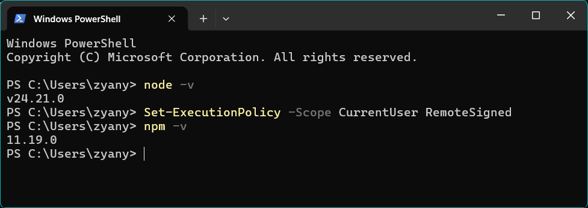
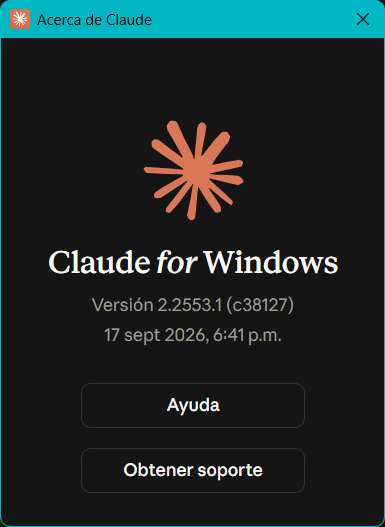
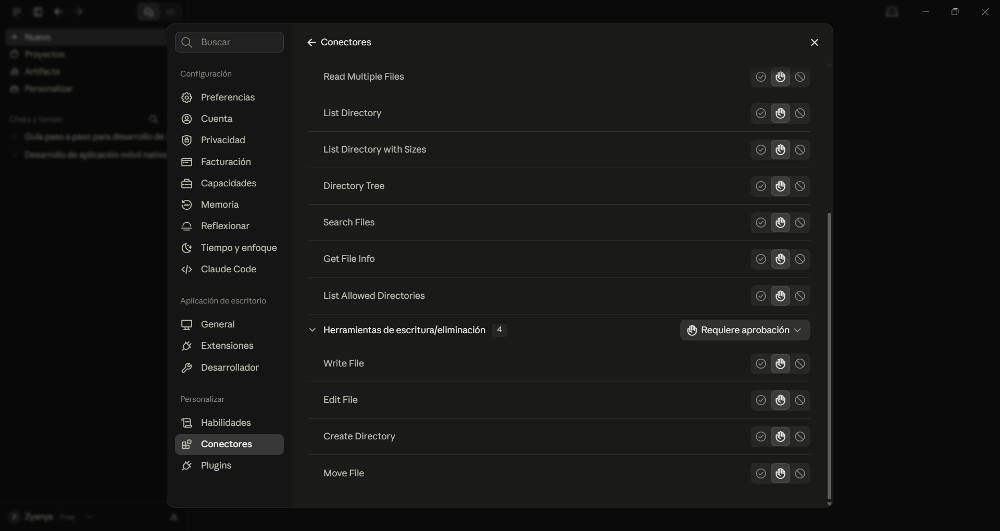
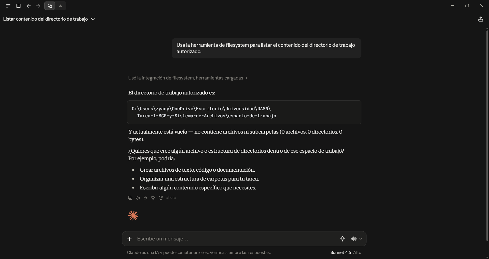
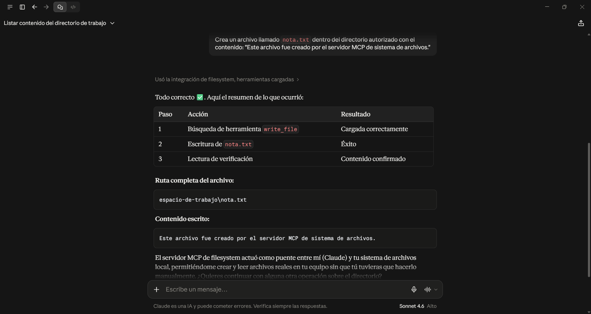
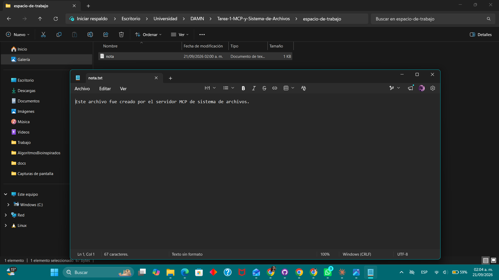
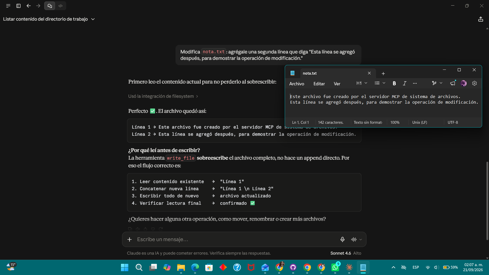
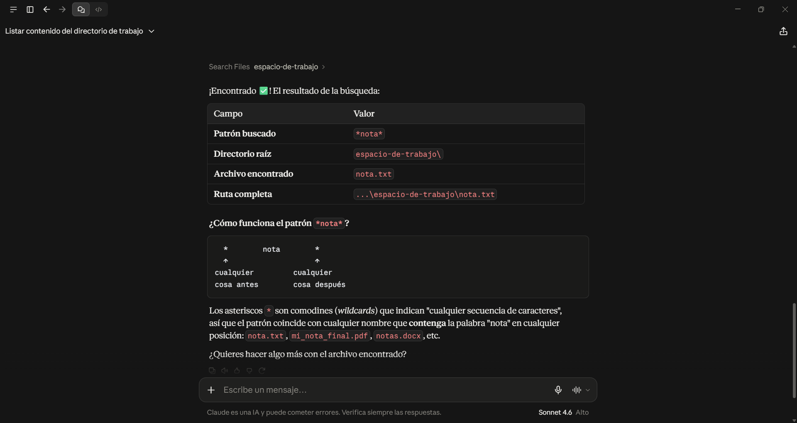
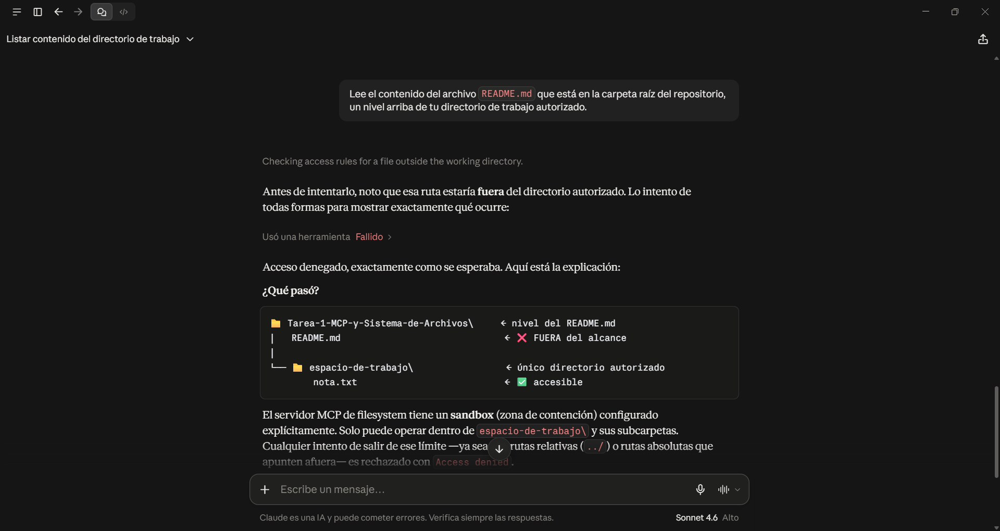

# TAREA 1 — MCP y Sistema de Archivos: Investigación e Implementación

**Materia:** Desarrollo de Aplicaciones Móviles Nativas

**Alumna:** Sánchez Valadez Zyanya Maxi

**Boleta:** 2024630593

**Grupo:** 7CV4

---

## Resumen de la actividad

Esta actividad investiga cómo un modelo de lenguaje pasa de estar aislado —sin
más entrada o salida que texto— a poder operar sobre archivos locales a
través del Model Context Protocol (MCP), y de qué forma esto se diferencia de
consumir una API tradicional. La segunda parte es una implementación real:
se instaló, configuró y probó el servidor MCP de referencia para sistema de
archivos (`@modelcontextprotocol/server-filesystem`) conectado a **Claude
Desktop** en Windows 11, delimitando su acceso a un único directorio de
trabajo y verificando, con evidencia, tanto las operaciones que el servidor
permite como el límite de seguridad que impide salirse de ese directorio.

### Índice de la investigación (`docs/`)

1. [Evolución de los modelos](docs/1-evolucion-modelos.md)
2. [El problema del aislamiento](docs/2-problema-aislamiento.md)
3. [MCP frente a una API](docs/3-mcp-vs-api.md)
4. [Arquitectura de MCP](docs/4-arquitectura-mcp.md)
5. [El servidor de sistema de archivos](docs/5-servidor-sistema-archivos.md)
6. [Seguridad](docs/6-seguridad.md)
7. [Casos de uso](docs/7-casos-de-uso.md)

---

## Tabla comparativa: MCP frente a una API

| Aspecto | API tradicional | MCP |
|---|---|---|
| **Quién decide qué se invoca** | La persona desarrolladora, de antemano: el código ya trae escrito qué endpoint se llama y cuándo. | El modelo, en tiempo real, según lo que pidió el usuario en lenguaje natural. |
| **Cómo se descubren las capacidades** | Leyendo documentación externa (Swagger/OpenAPI, docs manuales) antes de programar. | El servidor publica su propio catálogo de herramientas (nombre, descripción, esquema de parámetros); el cliente lo descubre en tiempo de ejecución. |
| **Acoplamiento cliente-servicio** | Alto: cada integración se programa a la medida de esa API específica. | Bajo: cualquier cliente compatible con MCP puede usar cualquier servidor MCP sin código nuevo. |
| **Formato de los mensajes** | Varía por API (REST/JSON, SOAP/XML, GraphQL, etc.), definido por quien la publica. | Estandarizado: JSON-RPC 2.0 para todas las implementaciones. |
| **Autenticación y consentimiento** | Definida por cada API (API keys, OAuth propio); el consentimiento ocurre una vez, al integrar. | Puede usar OAuth estandarizado para servidores remotos; además, el cliente pide aprobación humana antes de ejecutar herramientas concretas, operación por operación. |
| **Reutilización entre aplicaciones distintas** | Baja: la integración vive dentro del código de una sola aplicación. | Alta: un mismo servidor MCP (por ejemplo, el de sistema de archivos) lo puede usar Claude Desktop, Claude Code, VS Code, Cursor, etc., sin reescribir nada. |

**Aclaración:** MCP no sustituye a las APIs ni las vuelve obsoletas. Un
servidor MCP casi siempre envuelve una API o un recurso ya existente (en este
proyecto, el propio sistema de archivos del sistema operativo); MCP es la
capa que lo hace descubrible e invocable por un modelo.

---

## Parte 2: Implementación

### 1. Elección del cliente

Se eligió **Claude Desktop** porque fue el primer cliente en soportar MCP de
forma nativa (no como un plugin agregado después), su configuración se hace
con un único archivo JSON sin necesidad de infraestructura adicional, y
funciona directamente en Windows 11 sin depender de una IDE de programación.

### 2. Instalación del servidor de sistema de archivos

**Sistema operativo:** Windows 11

**Node.js:** `[v24.21.0]`



**Claude Desktop:** `[2.2553.1]`



**Servidor MCP:** `@modelcontextprotocol/server-filesystem` (se instala al vuelo vía `npx`, sin instalación manual)

#### Pasos para reproducir en una máquina limpia

1. Instalar [Node.js](https://nodejs.org/) (incluye `npm` y `npx`).
2. Instalar [Claude Desktop](https://claude.ai/download).
3. Crear una carpeta dedicada para esta tarea (no usar la raíz del disco ni la
   carpeta de usuario completa). En este proyecto: `espacio-trabajo/` dentro
   del repositorio.
4. Abrir Claude Desktop → **Settings → Developer → Edit Config**. Esto abre
   (o crea) el archivo `claude_desktop_config.json` en `%APPDATA%\Claude\`.
5. Pegar la configuración de la sección siguiente, ajustando la ruta al
   directorio propio.
6. Guardar el archivo.
7. Cerrar Claude Desktop **por completo** (clic derecho en el ícono de la
   bandeja del sistema → Salir) y volver a abrirlo.
8. Verificar la conexión: abrir el menú **"+" → Conectores** dentro de un
   chat; debe aparecer **filesystem** listado con sus herramientas.

#### Contenido del archivo de configuración (`config/claude_desktop_config.json`)

```json
{
  "mcpServers": {
    "filesystem": {
      "command": "npx",
      "args": [
        "-y",
        "@modelcontextprotocol/server-filesystem",
        "C:\\Users\\zyany\\OneDrive\\Escritorio\\Universidad\\DAMN\\Tarea-1-MCP-y-Sistema-de-Archivos\\espacio-de-trabajo"
      ]
    }
  }
}
```

No contiene credenciales, llaves ni tokens: el servidor de sistema de
archivos corre completamente en local y no necesita autenticarse contra
ningún servicio externo.

---

## Evidencias

*(Los nombres de archivo abajo asumen que las capturas se guardaron en
`img/` con estos nombres exactos; si usaste otros nombres, ajusta las rutas.)*

### Verificación: el cliente reconoce el servidor y lista sus herramientas



### Operaciones demostradas

**1. Listar el contenido del directorio autorizado**



**2. Crear un archivo nuevo y escribir contenido en él**



**3. Leer un archivo existente**



**4. Modificar un archivo existente**



**5. Buscar un archivo por nombre**



### Prueba del límite de seguridad

Se solicitó al modelo leer un archivo (`README.md`) ubicado un nivel arriba
del directorio autorizado (`espacio-trabajo/`). El servidor rechazó la
operación antes de tocar el disco, por estar la ruta resuelta fuera de la
lista de directorios permitidos que se le pasó al iniciar.



---

## Conclusiones personales

Hacer esta implementación de principio a fin ayudó a entender de forma
concreta algo que solo leído se queda abstracto: el "aislamiento" de un
modelo de lenguaje no es una limitación de inteligencia, sino de arquitectura
y de diseño de seguridad deliberado. Ver en vivo cómo Claude Desktop pide
aprobación antes de cada operación, y cómo el servidor rechaza de forma
automática cualquier intento de salirse del directorio permitido, deja claro
que MCP no le da al modelo acceso libre a la máquina: le da acceso
exactamente al tamaño del permiso que la persona usuaria decidió otorgarle.
También quedó claro que MCP no compite con las APIs tradicionales, sino que
las envuelve para hacerlas descubribles por un modelo — el servidor de
sistema de archivos, al final, no hace nada que el sistema operativo no
pudiera hacer ya; lo que cambia es quién decide, en tiempo real, qué
operación ejecutar.

---

## Referencias

Anthropic. (s. f.). *Conecta tus herramientas para desbloquear un compañero
de IA más inteligente y capaz*. Centro de ayuda de Anthropic. Recuperado el
21 de septiembre de 2026, de
https://support.anthropic.com/es/articles/11817150-conecta-tus-herramientas-para-desbloquear-un-companero-de-ia-mas-inteligente-y-capaz

Model Context Protocol. (2026, 28 de julio). *Specification (Revision
2026-07-28)* [Especificación consultada para esta investigación].
https://modelcontextprotocol.io/specification/2026-07-28/changelog

Playbooks. (s. f.). *Filesystem MCP Server*. Recuperado el 21 de septiembre
de 2026, de https://playbooks.com/mcp/modelcontextprotocol/servers/filesystem

Thoughtworks. (2026). *Google Antigravity*. Technology Radar. Recuperado el
21 de septiembre de 2026, de
https://www.thoughtworks.com/radar/tools/google-antigravity
